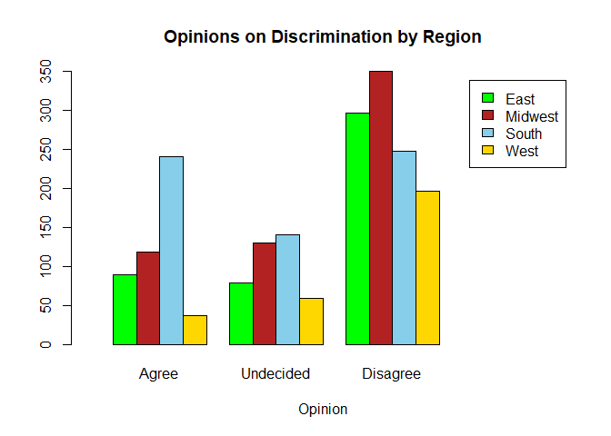

#### Background

Stereotypes about Race and Religion are all around the United States.  The very definition of a stereotype is a fact about a certain group that has been oversimplified and often overexagerated.  They quite often form the basis of prejiduce and discrimination.  

Sometime around 1965 a survey was conducted where students at a certain university were asked the following question. "Do you think that some racial and religious groups should be prevented from living in certain sections of cities?" A summary of their response are recorded in the following table. The region of the United States that the student respondent was from was also recorded.

The question that this analysis will face is, "Is there any kind of statistical evidence to support stereotypes of the different opinions based on region?" The stereotypes that this data can present information on, are 1) The South was heavily racist at the time, so of course they are going to be for discrimination. 2) The West is more Liberal/Progressive, so the west will obviously disagree with discrimination.

<div style="padding-left:20%; padding-right:20%;">

| Region | *Agree* | *Undecided* | *Disagree* |
|--------|---------|-------------|------------|
| East   |  89     |  79         |  297       |
| Midwest| 118     | 130         |  350       |
| South  | 241     | 140         |  248       |
| West   |  37     |  59         |  197       |

</div>


```r
discrim <- matrix(c(89,79,297,118,130,350,241,140,248,37,59,197), ncol = 3, byrow = T)
colnames(discrim) <- c("Agree","Undecided","Disagree")
rownames(discrim) <- c("East","Midwest","South","West")
```


#### Analysis

To see if there is any evidence to support these stereotypes a Chi squared test was used to determine independence of the Region and Opinions, using the table above.  To do this test, the following hypotheses are presented.

$$
H_o: \text{The Region and the Opinions are independent.}
$$

$$
H_a: \text{The Region and the Opinions are associated.}
$$


To get a visual understanding of the data, the following bar plot shows.
<!-- -->


The following Chi Squared table tests the variables for independence. An $\alpha = 0.05$ was used as the standard of significance for this test.


---------------------------------------
 Test statistic   df       P value     
---------------- ---- -----------------
      125         6    1.476e-24 * * * 
---------------------------------------

Table: Pearson's Chi-squared test: `discrim`

Since the p-value is far below the standard of significance, it can be concluded that there is sufficient evidence to reject the null hypothesis and accept the alternative hypothesis.  Thus the Region and Opinions are assosciated with each other.

However, the appropriateness must be checked and the expected counts must be more than 5:

--------------------------------------------
   &nbsp;      Agree   Undecided   Disagree 
------------- ------- ----------- ----------
  **East**     113.6     95.58      255.8   

 **Midwest**   146.1     122.9       329    

  **South**    153.7     129.3       346    

  **West**     71.59     60.22      161.2   
--------------------------------------------
Seeing that the expected counts are more than 5, the Chi Squarred test is an appropriate test to run for this data.

To get a clearer understanding of what knowledge is useful, the Pearson Residuals can be used to assess what elements had the most drastic change.  The Pearson Residuals are as follows.


---------------------------------------------
   &nbsp;      Agree    Undecided   Disagree 
------------- -------- ----------- ----------
  **East**     -2.309    -1.696      2.575   

 **Midwest**   -2.326    0.6392      1.159   

  **South**    7.043     0.9423      -5.27   

  **West**     -4.088    -0.1577     2.821   
---------------------------------------------
The residuals can also be plotted in the bar plot to give a visual on the most drastic changes. 

<!-- -->

The most drastic changes from the expected counts appear to be within the South disagreeing with discrimination, as well as the south aggreeing with discrimination. The south showed that a lower amount of people actually disagreed with discrimination than was expected, and a lot more people agreed with discrimination than was expected.  However, what can also be pointed out is that a lower amount of people in the West agreed with discrimination than what was expected.  

#### Interpretation

The conclusions drawn from this analysis are not all that surprising seeing that they do meet the stereotypes of the different regions for that time period, but it is interesting to see statistical evidence that supports those conclusions.

However, there are some limitations to this analysis, as there could be a lot more variables at play here than just the Region.  The data does not report any information on the race of each person taking the survey, nor does it account for each person's religion.  Rather than just making the general assumption about the region, this test could be taken further into the specific groups within each region, to see who really is for discrimination and who is not.  

Also, since this analysis was done around the time of the Civil Rights movement, no real conclusions can be made about the opinions of people within those regions today.  It would be interesting to do a more in depth study at this time to see if there is still statistical evidence to support these same stereotypes.
