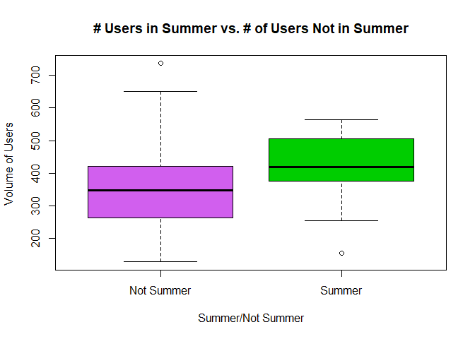
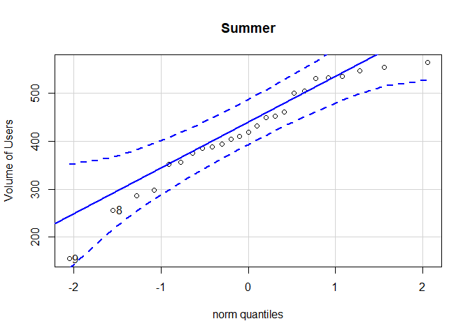
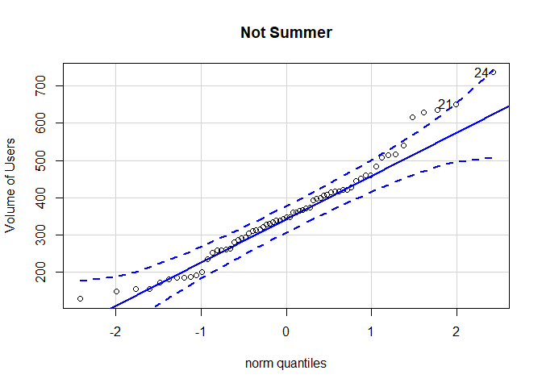

<!-- Instructions

1. Use the RailTrail dataset in R to come up with a question that can be answered with a t Test. 

2. Establish why the question is interesting and rephrase the question using a statistical "null" and "alternative" hypothesis.

3. Clearly answer your question using statistics. Be sure to compute a p-value and provide supporting numerical and graphical summaries.

For details about the RailTrail dataset type the command:
  > ?RailTrail 
into your Console and study the help file that appears. Also, if you want extra information, browse this document that has images and further details:
http://www.northamptonma.gov/DocumentCenter/View/5244   


Note: you can create "groups" from the data in many ways. For example, you can create a variable in your RailTrail dataset that is called "rain" and has categories of "yes" and "no" with the code:


```r
RailTrail$season<-ifelse(RailTrail$summer == 1,"Summer",ifelse(RailTrail$fall == 1, "Not Summer", "Not Summer"))
```
---->

#Background
In 2005 the Pioneer Valley Planning Commission conducted observations to record data north of Chestnut Street in Florence, MA.  They made 90 observtions in a 3 month time span.  The main focus of this analysis is on the question is there a greater volume of riders in the summer than not? The Null hypothesis states there is no difference in the means, but the proposed hypothesis of this analysis is that there is a greater volume in the summer than the other months. To put it mathematically,

$$
H_o: \mu_1-\mu_2 = 0 
$$

$$
H_a: \mu_1-\mu_2 > 0
$$

For this analysis the data has been organized to show what obervations were made in summer and what observations were made outside of sumer.  To do this a new column was created, called "season", where the data was assigned a "Summer" or "Not Summer Value" based on when the observation was made.  The columns "fall", "spring" and "summer" were then hidden from the data set as they had all been grouped into the new "season" column. Below is the dataset that is used for this analysis.  


<!--html_preserve--><div id="htmlwidget-b3d414acc1745c9195a2" style="width:100%;height:auto;" class="datatables html-widget"></div>
<script type="application/json" data-for="htmlwidget-b3d414acc1745c9195a2">{"x":{"filter":"none","data":[["1","2","3","4","5","6","7","8","9","10","11","12","13","14","15","16","17","18","19","20","21","22","23","24","25","26","27","28","29","30","31","32","33","34","35","36","37","38","39","40","41","42","43","44","45","46","47","48","49","50","51","52","53","54","55","56","57","58","59","60","61","62","63","64","65","66","67","68","69","70","71","72","73","74","75","76","77","78","79","80","81","82","83","84","85","86","87","88","89","90"],[83,73,74,95,44,69,66,66,80,79,78,65,41,59,50,54,97,75,63,42,70,57,71,46,61,81,64,57,62,83,76,74,59,77,52,67,51,41,90,70,81,72,70,69,59,60,72,70,76,56,66,84,58,56,79,67,75,65,70,64,51,77,60,74,84,61,49,71,70,83,90,92,88,62,86,67,59,89,63,59,74,80,55,62,74,95,65,55,89,80],[50,49,52,61,52,54,39,38,55,45,55,48,49,35,35,32,71,43,35,37,49,48,39,30,35,65,58,36,36,54,44,50,40,52,43,43,19,25,65,30,39,53,63,41,34,32,47,47,72,38,38,69,51,41,47,39,47,30,41,41,39,43,34,55,70,42,43,42,62,60,66,66,54,39,50,43,35,69,46,46,55,33,45,28,33,66,20,43,57,53],[66.5,61,63,78,48,61.5,52.5,52,67.5,62,66.5,56.5,45,47,42.5,43,84,59,49,39.5,59.5,52.5,55,38,48,73,61,46.5,49,68.5,60,62,49.5,64.5,47.5,55,35,33,77.5,50,60,62.5,66.5,55,46.5,46,59.5,58.5,74,47,52,76.5,54.5,48.5,63,53,61,47.5,55.5,52.5,45,60,47,64.5,77,51.5,46,56.5,66,71.5,78,79,71,50.5,68,55,47,79,54.5,52.5,64.5,56.5,50,45,53.5,80.5,42.5,49,73,66.5],[0,0,1,0,1,1,1,1,0,0,0,1,1,0,0,1,0,1,1,0,1,1,1,0,1,0,0,1,1,0,1,1,1,1,1,1,0,0,0,1,1,0,0,0,1,0,1,1,0,1,1,0,1,1,1,1,1,1,1,1,1,1,1,0,0,1,1,0,1,0,0,0,0,1,1,1,0,0,1,0,1,1,1,0,1,0,1,1,0,0],[1,1,0,1,0,0,0,0,1,1,1,0,0,0,0,0,1,0,0,0,0,0,0,0,0,1,1,0,0,1,0,0,0,0,0,0,0,0,1,0,0,1,1,0,0,0,0,0,1,0,0,1,0,0,0,0,0,0,0,0,0,0,0,1,1,0,0,0,0,1,1,1,1,0,0,0,0,1,0,0,0,0,0,0,0,1,0,0,1,1],[0,0,0,0,0,0,0,0,0,0,0,0,0,1,1,0,0,0,0,1,0,0,0,1,0,0,0,0,0,0,0,0,0,0,0,0,1,1,0,0,0,0,0,1,0,1,0,0,0,0,0,0,0,0,0,0,0,0,0,0,0,0,0,0,0,0,0,1,0,0,0,0,0,0,0,0,1,0,0,1,0,0,0,1,0,0,0,0,0,0],[7.59999990463257,6.30000019073486,7.5,2.59999990463257,10,6.59999990463257,2.40000009536743,0,3.79999995231628,4.09999990463257,8.5,7.19999980926514,10,7.69999980926514,5.80000019073486,3.59999990463257,6.09999990463257,6.30000019073486,8.60000038146973,10,7.90000009536743,6.80000019073486,5.19999980926514,9.69999980926514,4.40000009536743,10,10,6.5,0,1.20000004768372,1.79999995231628,8,9.39999961853027,5,5.80000019073486,6.69999980926514,0,0,8.39999961853027,0,0,7.90000009536743,9.89999961853027,6.40000009536743,2.40000009536743,1.20000004768372,4.09999990463257,9.89999961853027,9.69999980926514,0,3.90000009536743,8.89999961853027,10,7,7,6.80000019073486,6.80000019073486,4.30000019073486,5.09999990463257,3.40000009536743,10,0.400000005960464,10,4.59999990463257,9.89999961853027,6.40000009536743,9.69999980926514,4,3,8.19999980926514,6.59999990463257,7.90000009536743,6.19999980926514,0.800000011920929,6.19999980926514,0.400000005960464,1.70000004768372,9,6.90000009536743,10,7.80000019073486,0.699999988079071,9.60000038146973,5.69999980926514,2.5,4.09999990463257,9.39999961853027,9,1.89999997615814,3.79999995231628],[0,0.28999999165535,0.319999992847443,0,0.140000000596046,0.0199999995529652,0,0,0,0,0,0,0.0299999993294477,0,0,0,0.680000007152557,0,0,0.150000005960464,0,0,0,0.200000002980232,0,1.44000005722046,1.14999997615814,0.00999999977648258,0,0,0,0.119999997317791,0.340000003576279,0,0.00999999977648258,0,0,0,0,0,0,0,0,0,0,0,0,0,0.349999994039536,0,0,0.00999999977648258,0.150000005960464,0,0.00999999977648258,0.0199999995529652,0,0,0,0,0.159999996423721,0,0,0,1.49000000953674,0.00999999977648258,0.119999997317791,0,0,0.140000000596046,0,0,0,0,0,0,0,0.360000014305115,0.170000001788139,0,0,0,0.200000002980232,0.0199999995529652,0,0,0.219999998807907,0,0,0],[501,419,397,385,200,375,417,629,533,547,432,418,193,331,280,304,352,156,365,181,514,259,452,189,362,256,155,174,259,535,650,409,311,736,186,371,291,287,411,461,540,376,554,339,344,348,517,328,298,335,186,505,156,362,507,407,421,393,422,349,150,429,293,461,388,322,129,415,460,405,453,395,531,236,484,445,252,286,400,261,339,617,316,367,635,449,314,264,356,564],[true,true,true,false,true,true,true,false,false,true,true,true,true,true,true,true,false,true,true,true,false,true,true,true,true,true,true,true,true,false,false,true,true,false,true,true,false,true,true,false,true,true,true,true,true,false,true,true,true,true,true,true,true,true,false,false,true,true,true,true,true,true,true,true,true,true,false,false,true,true,true,true,true,true,true,true,true,false,false,false,false,false,false,false,false,false,false,false,false,false],["weekday","weekday","weekday","weekend","weekday","weekday","weekday","weekend","weekend","weekday","weekday","weekday","weekday","weekday","weekday","weekday","weekend","weekday","weekday","weekday","weekend","weekday","weekday","weekday","weekday","weekday","weekday","weekday","weekday","weekend","weekend","weekday","weekday","weekend","weekday","weekday","weekend","weekday","weekday","weekend","weekday","weekday","weekday","weekday","weekday","weekend","weekday","weekday","weekday","weekday","weekday","weekday","weekday","weekday","weekend","weekend","weekday","weekday","weekday","weekday","weekday","weekday","weekday","weekday","weekday","weekday","weekend","weekend","weekday","weekday","weekday","weekday","weekday","weekday","weekday","weekday","weekday","weekend","weekend","weekend","weekend","weekend","weekend","weekend","weekend","weekend","weekend","weekend","weekend","weekend"],["Summer","Summer","Not Summer","Summer","Not Summer","Not Summer","Not Summer","Not Summer","Summer","Summer","Summer","Not Summer","Not Summer","Not Summer","Not Summer","Not Summer","Summer","Not Summer","Not Summer","Not Summer","Not Summer","Not Summer","Not Summer","Not Summer","Not Summer","Summer","Summer","Not Summer","Not Summer","Summer","Not Summer","Not Summer","Not Summer","Not Summer","Not Summer","Not Summer","Not Summer","Not Summer","Summer","Not Summer","Not Summer","Summer","Summer","Not Summer","Not Summer","Not Summer","Not Summer","Not Summer","Summer","Not Summer","Not Summer","Summer","Not Summer","Not Summer","Not Summer","Not Summer","Not Summer","Not Summer","Not Summer","Not Summer","Not Summer","Not Summer","Not Summer","Summer","Summer","Not Summer","Not Summer","Not Summer","Not Summer","Summer","Summer","Summer","Summer","Not Summer","Not Summer","Not Summer","Not Summer","Summer","Not Summer","Not Summer","Not Summer","Not Summer","Not Summer","Not Summer","Not Summer","Summer","Not Summer","Not Summer","Summer","Summer"]],"container":"<table class=\"display\">\n  <thead>\n    <tr>\n      <th> <\/th>\n      <th>hightemp<\/th>\n      <th>lowtemp<\/th>\n      <th>avgtemp<\/th>\n      <th>spring<\/th>\n      <th>summer<\/th>\n      <th>fall<\/th>\n      <th>cloudcover<\/th>\n      <th>precip<\/th>\n      <th>volume<\/th>\n      <th>weekday<\/th>\n      <th>dayType<\/th>\n      <th>season<\/th>\n    <\/tr>\n  <\/thead>\n<\/table>","options":{"lengthMenu":[3,10,30],"columnDefs":[{"className":"dt-right","targets":[1,2,3,4,5,6,7,8,9]},{"orderable":false,"targets":0}],"order":[],"autoWidth":false,"orderClasses":false}},"evals":[],"jsHooks":[]}</script><!--/html_preserve-->


#Analysis

To answer the question, it was determined that an Independent Sample t Test would be essential for producing the info that was needed.  The test compared the means of volume for riders in the summer versus the volume of riders not in the summer. Below is the summary of the test. Again, the Null hypothesis was that the difference would be 0, and the alternative hypothesis was that the difference of the means would be greater than 0, using an $\alpha$ = 0.05 or 5% level of significance.


-------------------------------------------------------------------------
 Test statistic    df      P value    Alternative hypothesis   mean of x 
---------------- ------- ----------- ------------------------ -----------
     2.446        55.65   0.01765 *         two.sided            421.9   
-------------------------------------------------------------------------

Table: Welch Two Sample t-test: `subset(RailTrail, summer == "1")$volume` and `subset(RailTrail, summer == "0")$volume` (continued below)

 
-----------
 mean of y 
-----------
   357.5   
-----------

To better visually represent the data, the following boxplot was also created to display the differences in the mean of the two groups.

```r
boxplot(volume ~ season, data = RailTrail, xlab= "Summer/Not Summer", ylab= "Volume of Users ", main= "# Users in Summer vs. # of Users Not in Summer", col = c("mediumorchid2","green3"))
```

<!-- -->

The box plot gives a very clear image of the mean volume in the summer being higher than the mean of the non summer observations.  This can be seen by looking at the difference between the black lines in each of the boxes. Though there is a lot more data for the non summer observations, it does show that there is a higher concentration of volume in the summer observations than in the non summer observations.

#### Justification

It appears from the qq plots below that the data on the number of users of the Rail Trail in both Summer and Not Summer groups is normally distributed.  However, there are a few points in the Not Summer group that are a little concerning, but for the most part the independent samples t-test does seem to be an appropriate test to run for this data set.

<!-- -->

```
## [1] 9 8
```

<!-- -->

```
## [1] 24 21
```

#Interpretation

Based off of the results of the Independent samples t Test, the P value was calculated to be roughly 0.0176 which is far below the established level of significance of $\alpha$ = 0.05 or 5%.  Because the P value is so low, their is significant evidence to reject the Null hypothesis and accept the proposed alternative hypothesis.  In other words, there is enough statistical evidence that shows there truly is a greater observed volume in the summer than in the non summer observations.

Some limitations to this study include the fact that not all of the groups were observed from the original data set.  It was strictly summer or not summer observations that were taken, hence why the range of the "Not Summer" box plot were a lot bigger than summer because it contained the data from both fall and spring.  However, for future observations an ANOVA test would be most appropriate to look at all 3 groups (fall, spring, summer) at once and determine what season the highest mean volume was observed.  

