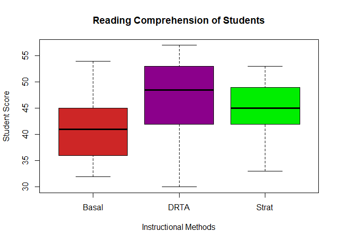

<script type="text/javascript">
 function showhide(id) {
    var e = document.getElementById(id);
    e.style.display = (e.style.display == 'block') ? 'none' : 'block';
 }
</script>


```r
#Play the above chunk and this one in your Console to access the data
View(Baumann)
?Baumann
```

### Background

"This study investigated the effectiveness of explicit instruction in 'think aloud' as a means to promote elementary students' comprehension monitoring abilities" [(Baumann & Jones, 1992)](http://jlr.sagepub.com/content/24/2/143.full.pdf).


<a href="javascript:showhide('abstract')">Details of the Study<span style="font-size:8pt;">&nbsp;(click to view)</span></a>

<div id="abstract" style="display:none;">

The following explanation of the experiment comes directly from the original research article [(Baumann & Jones, 1992)](http://jlr.sagepub.com/content/24/2/143.full.pdf).

<div style="padding-left:30px; padding-right:30px;">

Fourth-grade students from an elementary school in a rural midwestern community participated in the study. The school had adopted a team teaching plan, and three fourth-grade teachers shared an open classroom area. The teachers grouped the students for reading instruction across the three classes according to reading ability. One teacher each worked with a high [ability reading group], [one teacher worked with a] middle [ability group], and [the other teacher worked with the] low reading [ability] group. All groups used basal reading materials and were formed at the beginning of the school year on the basis of standardized achievement test data, prior performance in the basal reading program, and teacher judgment.

Sixty-eight of the 72 students in the fourth-grade team participated in the study; the four nonparticipating students were mainstreamed special education students for whom the instructional materials were considered to be too frustrating to read. The 68 students were assigned randomly to one of the three experimental groups (Strat = 23 students; DRTA = 23 students; Basal = 22 students). Because of illness and transfer to another school, incomplete data were obtained for one subject each from the Strat and DRTA groups. Thus, the final sample consisted of 66 students, 32 girls and 34 boys.

Posttests 1-3 were group-administered, quantitative measures obtained
for all students in the sample. Posttest 1 was an error detection test. Posttest 2 was a comprehension monitoring questionnaire. Posttest 3 was a modified cloze test. To statistically account for students'
preexperimental differences in comprehension monitoring abilities, two pretests were constructed, administered, and used as covariates in data analyses for Posttests 1-3.

Pretest 1. The first pretest involved an error detection task designed to evaluate students' preintervention ability to monitor their comprehension.... Students were provided the following directions which were printed on the pretest and read aloud by the experimenter: 'Read the story carefully. Try to understand it as you read. There will be 16 sentences that do not belong in the story. Look for them as you read. Ask yourself, "What does not make sense in this story?" Underline the 16 sentences that do not make sense. Check your work when you are finished. If you cannot read a
word, raise your hand, and we will help you.' Preceding Pretest 1, students were given a brief practice exercise that required them to identify obvious intruded sentences in two short texts. Pretest 1 was scored by calculating the number of correctly identified intruded sentences.

Pretest 2. The second pretest queried students about the strategies they believed to be useful in promoting their understanding of stories. In this pretest, modeled after an instrument developed by Schmitt (1988, 1990), the students were presented with 15 multiple-choice items like the following:

<div style="padding-left:15px;">
When I read, it is a good idea to:

A. sound out words I don't know.

B. make some guesses about what will happen in the story.

C. make a list of all the details in the story.

D. look up new words in the dictionary.

</div>

Posttest 1: Error detection test. Posttest 1 was the same in form as Pretest 1: with 16 intruded sentences lexically consistent at a local level but semantically inconsistent at a global level. 

Posttest 2: Comprehension monitoring questionnaire. Posttest 2, consisting of 18 items, was a slightly expanded version of Pretest 2. 

Posttest 3: Degrees of Reading Power. The Degrees of Reading Power (DRP)
(1986) is a standardized, commercially produced instrument that employs a modified cloze format (words are deleted from a selection and for each omission the student selects the most appropriate word from a list of five). According to the authors, DRP tests "are holistic measures of how well the messages within text are understood. . . . DRP tests focus measurement on determining how well students process or construct meaning from paragraphs as they read through a selection" (DRP Handbook, 1986, p. 1). Thus, the DRP, at one level, is a general reading comprehension assessment tool.

</div>

The data for this study are contained in the `Baumann` dataset.

</div>

In short, this study was done to see if there are better methods out there for helping students reading comprehension.  This is important because if the education system can find better methods of improving reading comprehension, then they will help students be better prepared for higher education.  The study compared the traditional teaching method with two other innovative methods to see if there was any difference in reading comprehension scores in a set of different tests.

### Data and Hypothesis


With the given data from the research study below, it was determined that the most accurate results could be obtained by running a Kruskal-Wallis test on Post Test 3, since it was a comprehensive test at the end of the year as well as a widely recognized test.  Thus the null hypothesis for this test is that all groups are from the same distribution, and the alternative is that at least one group's distribution is stochastically different than the others.

$$
H_o: \text{All samples are from the same distribution.}
$$

$$
H_a: \text{At least one samples distribution is stochastically different.}  
$$ 


<!--html_preserve--><div id="htmlwidget-1c37d92d45eb2b99785e" style="width:100%;height:auto;" class="datatables html-widget"></div>
<script type="application/json" data-for="htmlwidget-1c37d92d45eb2b99785e">{"x":{"filter":"none","data":[["1","2","3","4","5","6","7","8","9","10","11","12","13","14","15","16","17","18","19","20","21","22","23","24","25","26","27","28","29","30","31","32","33","34","35","36","37","38","39","40","41","42","43","44","45","46","47","48","49","50","51","52","53","54","55","56","57","58","59","60","61","62","63","64","65","66"],["Basal","Basal","Basal","Basal","Basal","Basal","Basal","Basal","Basal","Basal","Basal","Basal","Basal","Basal","Basal","Basal","Basal","Basal","Basal","Basal","Basal","Basal","DRTA","DRTA","DRTA","DRTA","DRTA","DRTA","DRTA","DRTA","DRTA","DRTA","DRTA","DRTA","DRTA","DRTA","DRTA","DRTA","DRTA","DRTA","DRTA","DRTA","DRTA","DRTA","Strat","Strat","Strat","Strat","Strat","Strat","Strat","Strat","Strat","Strat","Strat","Strat","Strat","Strat","Strat","Strat","Strat","Strat","Strat","Strat","Strat","Strat"],[4,6,9,12,16,15,14,12,12,8,13,9,12,12,12,10,8,12,11,8,7,9,7,7,12,10,16,15,9,8,13,12,7,6,8,9,9,8,9,13,10,8,8,10,11,7,4,7,7,6,11,14,13,9,12,13,4,13,6,12,6,11,14,8,5,8],[3,5,4,6,5,13,8,7,3,8,7,2,5,2,2,10,5,5,3,4,3,6,2,6,4,1,8,7,6,7,7,8,6,2,4,6,4,4,5,6,2,6,5,6,7,6,6,2,6,5,5,6,6,5,3,9,6,8,4,3,6,4,4,2,3,3],[5,9,5,8,10,9,12,5,8,7,12,4,4,8,6,9,3,5,4,2,5,7,7,5,13,5,14,14,10,13,12,11,8,7,10,8,8,10,12,10,11,7,8,12,11,4,4,4,3,8,12,14,12,7,5,9,1,13,7,5,7,11,15,9,6,4],[4,5,3,5,9,8,5,5,7,7,4,4,6,8,4,10,3,5,5,3,4,8,6,6,3,7,7,6,9,5,7,6,5,0,6,6,7,11,6,6,6,8,8,6,12,8,10,4,9,5,8,12,11,11,10,9,10,1,9,13,9,7,7,5,8,6],[41,41,43,46,46,45,45,32,33,39,42,45,39,44,36,49,40,35,36,40,54,32,31,40,48,30,42,48,49,53,48,43,55,55,57,53,37,50,54,41,49,47,49,49,53,47,41,49,43,45,50,48,49,42,38,42,34,48,51,33,44,48,49,33,45,42]],"container":"<table class=\"display\">\n  <thead>\n    <tr>\n      <th> <\/th>\n      <th>group<\/th>\n      <th>pretest.1<\/th>\n      <th>pretest.2<\/th>\n      <th>post.test.1<\/th>\n      <th>post.test.2<\/th>\n      <th>post.test.3<\/th>\n    <\/tr>\n  <\/thead>\n<\/table>","options":{"lengthMenu":[3,10,30],"columnDefs":[{"className":"dt-right","targets":[2,3,4,5,6]},{"orderable":false,"targets":0}],"order":[],"autoWidth":false,"orderClasses":false}},"evals":[],"jsHooks":[]}</script><!--/html_preserve-->

### Analysis

# {.tabset .tabset-pills .tabset-fade}

##Kruskal-Wallis Test

To determine if there is sufficient enough evidence to reject the null hypothesis, a Kruskal-Wallis Rank Sum test was run on the "post.test.3" and "group" variables, with an $\alpha$ = 0.05 level of significance.  The following results were obtained.


----------------------------------
 Test statistic   df    P value   
---------------- ---- ------------
     9.632        2    0.0081 * * 
----------------------------------

Table: Kruskal-Wallis Rank Sum Test

The table above shows that a p value of 0.0081 was obtained from the test, which is very significant.  Thus there is sufficient evidence to reject the null hypothesis and accept the alternative, which means that at least one of the sample distributions is stochastically different.

##Graphical and Numerical Summaries

Because there was sufficient evidence to reject the null hypothesis, the boxplot and numerical summary below can be trusted.  

<!-- -->


---------------------------------------------------------------------------
 group   min    Q1     median    Q3     max   mean     sd     n    missing 
------- ----- ------- -------- ------- ----- ------- ------- ---- ---------
 Basal   32    36.75     41      45     54    41.05   5.636   22      0    

 DRTA    30    42.25    48.5    52.25   57    46.73   7.388   22      0    

 Strat   33     42       45     48.75   53    44.27   5.767   22      0    
---------------------------------------------------------------------------

Both the box plot and numerical summary show that there is a difference in means and medians of student scores between all of the groups, and that one experimental method was more effective than the others.
</div>


### Interpretation

The obvious front runner amongst the experimental groups is the DRTA group.  This group had a significantly higher median score of 48.8 and also a higher mean score of 46.73. This means that the best method for helping students with reading comprehension was used in the DRTA experimental group.  However, due to lack of description as to what each experimental method entailed, all that can be said is that the DRTA or one of the "innovative" experimental methods showed significant superiority over the Basal ("traditional method"") and the Strat (other "innovative" method) groups.

