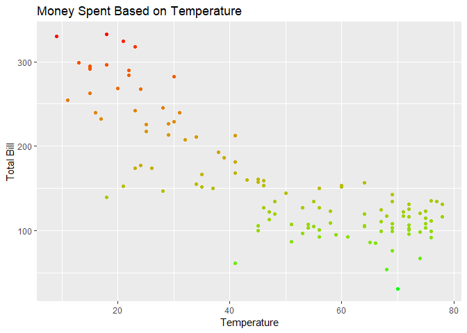
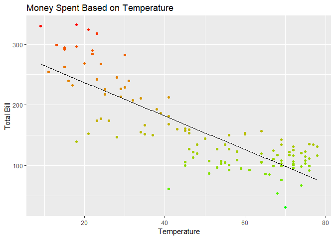
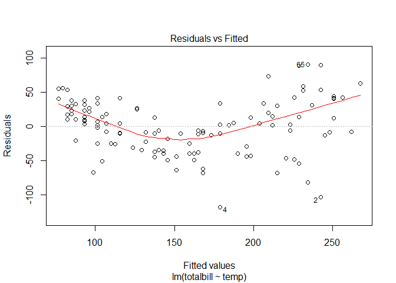
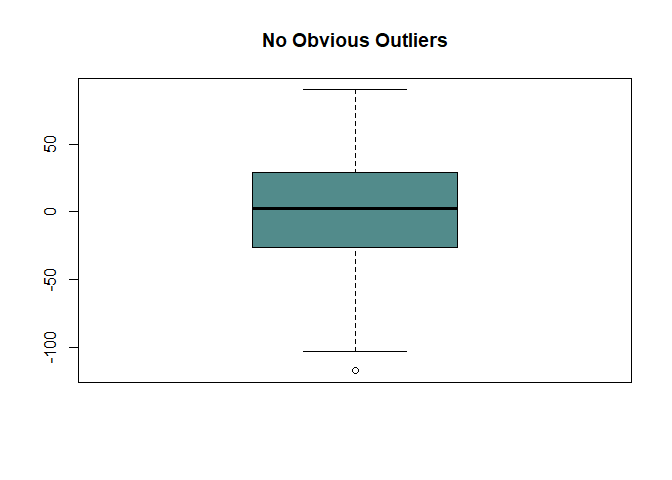
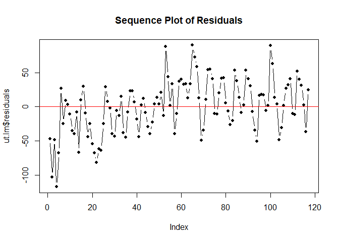
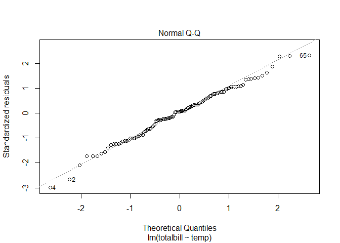
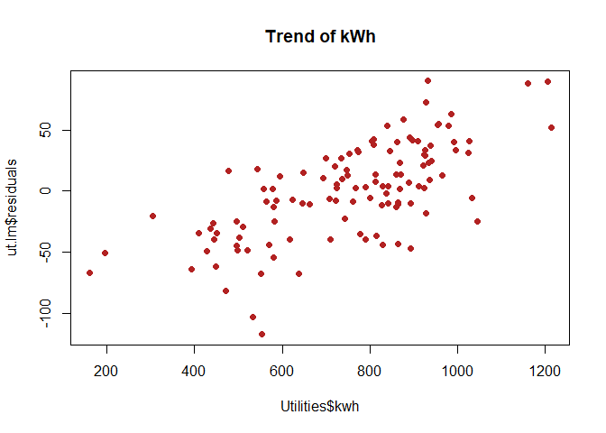
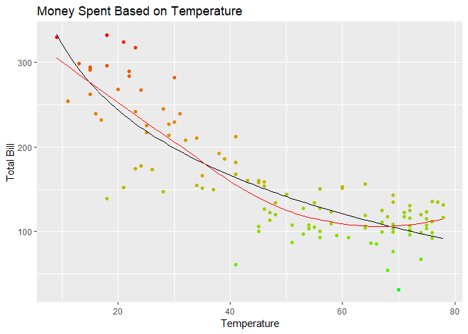

## Background

This analysis will focus on data that was gathered from utility bills at an unknown residence (see table below).


```r
datatable(Utilities, options=list(lengthMenu = c(3,10,30)))
```

<!--html_preserve--><div id="htmlwidget-a95688348166182c9e46" style="width:100%;height:auto;" class="datatables html-widget"></div>
<script type="application/json" data-for="htmlwidget-a95688348166182c9e46">{"x":{"filter":"none","data":[["1","2","3","4","5","6","7","8","9","10","11","12","13","14","15","16","17","18","19","20","21","22","23","24","25","26","27","28","29","30","31","32","33","34","35","36","37","38","39","40","41","42","43","44","45","46","47","48","49","50","51","52","53","54","55","56","57","58","59","60","61","62","63","64","65","66","67","68","69","70","71","72","73","74","75","76","77","78","79","80","81","82","83","84","85","86","87","88","89","90","91","92","93","94","95","96","97","98","99","100","101","102","103","104","105","106","107","108","109","110","111","112","113","114","115","116","117"],[12,1,2,3,4,5,6,7,8,9,10,11,12,6,7,8,9,10,11,1,2,3,4,5,6,7,8,9,10,11,12,2,3,4,5,6,7,8,9,10,11,12,1,2,3,4,5,6,7,8,9,11,12,1,2,3,4,5,6,7,8,9,10,11,12,1,2,3,4,5,6,7,8,9,10,11,12,1,2,3,4,5,6,7,8,9,10,11,12,2,3,4,5,6,7,8,9,10,11,12,1,2,3,4,5,6,7,8,9,10,11,12,1,2,3,4,5],[29,28,26,25,28,30,24,26,24,25,24,26,27,26,26,26,25,24,26,28,26,27,28,28,26,28,26,25,24,24,29,26,27,28,28,26,28,26,25,26,24,29,28,26,28,27,26,27,27,25,26,23,28,27,24,29,28,26,27,27,25,26,25,27,28,29,27,28,26,25,26,26,24,25,24,26,27,28,26,26,26,28,26,27,26,25,24,26,27,26,27,27,27,25,27,25,25,26,24,29,28,26,29,28,28,28,28,28,27,26,24,30,28,28,29,27,36],[1999,2000,2000,2000,2000,2000,2000,2000,2000,2000,2000,2000,2000,2001,2001,2001,2001,2001,2001,2002,2002,2002,2002,2002,2002,2002,2002,2002,2002,2002,2002,2003,2003,2003,2003,2003,2003,2003,2003,2003,2003,2003,2004,2004,2004,2004,2004,2004,2004,2004,2004,2004,2004,2005,2005,2005,2005,2005,2005,2005,2005,2005,2005,2005,2005,2006,2006,2006,2006,2006,2006,2006,2006,2006,2006,2006,2006,2007,2007,2007,2007,2007,2007,2007,2007,2007,2007,2007,2007,2008,2008,2008,2008,2008,2008,2008,2008,2008,2008,2008,2009,2009,2009,2009,2009,2009,2009,2009,2009,2009,2009,2009,2010,2010,2010,2010,2010],[26,18,24,41,45,60,66,72,72,64,54,37,11,70,76,75,64,51,48,23,28,21,45,51,69,76,72,69,47,34,25,17,29,46,56,67,72,75,69,53,35,25,15,16,35,48,58,64,72,67,71,43,23,15,29,31,54,56,72,78,74,69,56,41,21,30,22,34,53,59,74,78,77,64,50,41,30,24,13,38,46,65,74,76,75,68,58,41,18,15,28,45,55,68,76,75,67,55,39,18,9,23,32,47,61,69,71,72,69,45,46,22,15,20,41,56,60],[892,533,521,554,638,700,583,935,789,864,778,617,586,160,736,923,865,828,1046,581,551,471,449,394,496,925,812,838,790,865,1032,580,648,503,496,722,934,869,888,927,570,725,594,563,510,709,742,911,860,841,922,860,1160,891,557,772,444,645,939,862,845,995,965,926,931,927,876,749,428,450,694,954,957,1027,893,663,720,897,808,724,707,442,305,839,809,812,761,767,980,804,752,623,410,196,477,544,746,801,868,1205,986,870,830,497,436,579,734,774,909,842,826,1213,992,1024,923,814,941],[194,164,228,16,74,129,23,0,13,17,37,123,235,1,7,15,20,44,79,210,178,190,106,60,23,16,15,16,69,126,190,224,153,100,43,18,15,14,16,48,130,204,242,216,144,78,35,18,8,15,15,82,208,224,166,179,61,51,19,11,9,11,32,99,176,144,161,116,52,38,10,7,6,15,47,101,140,168,191,101,77,18,7,9,6,13,28,98,182,191,139,79,29,6,11,12,16,32,91,199,211,159,134,74,34,19,15,10,18,62,67,188,206,187,95,31,31],[5.5,5.6,8,0.6,2.2,4.1,0.9,0,0.4,0.5,1.3,3.8,7.7,0.1,0.2,0.5,0.7,1.6,2.4,6.6,6.2,6.6,3.3,2,0.8,0.5,0.5,0.5,2.4,4.1,5.5,7.8,5.3,3.2,1.4,0.6,0.5,0.5,0.5,1.5,4.6,5.9,8.1,7.6,4.7,2.6,1.2,0.6,0.3,0.5,0.5,2.8,6,7.5,6,5.5,2,1.8,0.6,0.4,0.3,0.3,1.1,3.1,5.8,4.5,5.6,4,1.8,1.3,0.3,0.2,0.2,0.5,1.6,3.1,4.5,5.3,6.7,3.6,2.6,0.6,0.2,0.3,0.2,0.4,1,3,6,6.7,4.7,2.6,1,0.2,0.3,0.4,0.5,1.1,3,5.8,7.2,5.6,4.4,2.5,1.2,0.6,0.5,0.3,0.6,2.2,2.3,5.4,6.9,6.1,3.3,1.1,1.1],[36,30,29,28,34,32,25,32,29,32,29,33,31,10,30,31,30,29,33,32,29,29,32,30,29,32,29,30,29,31,35,29,29,32,30,29,32,29,30,31,29,35,30,29,31,30,29,32,30,29,32,29,35,30,28,33,30,28,32,30,29,32,29,33,31,32,29,29,29,29,32,30,29,32,29,33,31,32,29,29,30,32,29,30,31,30,29,33,31,29,30,31,30,29,32,29,31,31,29,35,30,29,31,30,30,31,30,29,32,29,29,36,29,31,29,29,29],[173.65,139.18,177.48,61.27,100.33,153.32,85.3,102.44,96.47,104.86,107.5,150.13,254.23,31.55,92.36,114.95,105.91,107.58,134.5,174.45,147.06,152.32,106.04,87.47,76.43,111.65,101.39,99.46,122.51,154.93,217.42,232.41,226.92,127.07,92.86,99.52,116.29,108.04,108.54,127.37,151.62,225.73,262.81,239.6,166.51,120.08,109.38,119.65,106.65,111.08,117.46,160.26,317.47,294.96,213.71,239.85,103.34,127.22,131.02,116.72,120.53,135.07,150.62,212.49,324.52,282.25,289.91,210.85,96.87,95.04,98.48,131.27,134.96,156.51,144.16,168.24,229.4,267.72,298.5,192.67,159.01,86.54,67.19,135.73,123.07,117.82,123.4,181.53,296.1,292.12,245.27,160.69,105.5,53.92,99.14,103.28,124.82,134.3,186.18,332.09,330.27,242.12,207.96,113.5,93.09,103.7,122.7,125.37,142.82,158.02,153.68,283.69,291.1,268.07,181.82,100.61,151.57],[112.72,95.88,134.65,15.32,47.33,89.87,25.55,8.08,17.66,21.39,41.19,102.52,210.87,3.42,12.79,18.1,20.17,32.38,53.6,127.86,102.85,113.63,70.34,48.92,23.42,18.61,17.56,18.16,55.74,94.67,140.49,187.05,176.02,86.83,43.77,24.46,21.28,19.56,21.08,45.28,106.61,168.93,216.89,193.45,124.18,65.67,39.4,25.14,15.59,21.72,21.25,88.51,224.18,223.92,166.63,117.05,64.99,61.81,27.3,19.96,18.16,22.33,55.74,153.24,240.9,193.84,198.11,138.65,55,47.39,19.19,16.37,15.88,25.74,46.12,106.54,159.08,178.16,207.53,118.78,82.76,32.98,21.41,22.87,19.17,24.54,38.59,104.52,194.91,207.32,167.3,97.11,52.15,20.97,69.82,26.83,29.77,41.74,93.6,209.21,225.72,147.82,114.66,58.03,37.33,24.88,22.86,19.43,23.72,58.38,61.46,131.49,180.73,163.62,79.15,29.44,38.29],[68.25,43.3,42.83,45.95,53,63.45,59.75,94.36,78.81,83.47,66.31,47.61,46.59,17.43,79.57,96.85,85.74,75.2,80.9,46.59,44.21,38.69,35.7,38.55,53.01,93.04,83.83,82.2,66.77,65.02,76.93,45.36,50.9,40.24,49.09,75.06,95.01,89.12,87.46,82.09,45.01,56.8,47.37,46.15,42.33,54.41,69.98,94.51,91.06,89.36,96.21,71.75,93.29,71.04,47.08,62.8,38.35,65.41,103.72,96.76,102.37,112.74,94.88,84.75,83.62,90.28,91.8,72.2,41.87,47.65,79.32,114.9,119.3,130.77,98.04,62.72,70.32,89.97,90.97,73.89,76.25,53.56,45.78,112.99,103.9,98.9,85.81,77.01,101.19,84.8,77.97,63.58,53.35,32.95,29.32,76.45,95.05,92.56,92.58,122.88,104.55,94.3,93.3,55.47,55.76,78.82,99.84,105.94,119.1,102.52,92.22,152.2,110.37,114.02,102.67,95.22,113.18],["","","","bad meter reading","","","","","","","","","","transfer back from England","","","","","","","","","","","","","","","","","","","","","","","","","","","","","","","","","","","","","","","","","","","","","","high efficiency gas furnace and gas water heater installed","","","","","","","","","","","away for 10 days on vacation","","","","","","","","","","","","","","","5.46 credit for \"cost of gas\"","","","","housesitters","housesitters","housesitters","housesitters","empty house","empty house","","","","","","","","","","","","","Was this August?","","","","estimated reading","","9.57 escrow refund","","24.05 interim elec refund",""]],"container":"<table class=\"display\">\n  <thead>\n    <tr>\n      <th> <\/th>\n      <th>month<\/th>\n      <th>day<\/th>\n      <th>year<\/th>\n      <th>temp<\/th>\n      <th>kwh<\/th>\n      <th>ccf<\/th>\n      <th>thermsPerDay<\/th>\n      <th>billingDays<\/th>\n      <th>totalbill<\/th>\n      <th>gasbill<\/th>\n      <th>elecbill<\/th>\n      <th>notes<\/th>\n    <\/tr>\n  <\/thead>\n<\/table>","options":{"lengthMenu":[3,10,30],"columnDefs":[{"className":"dt-right","targets":[1,2,3,4,5,6,7,8,9,10,11]},{"orderable":false,"targets":0}],"order":[],"autoWidth":false,"orderClasses":false}},"evals":[],"jsHooks":[]}</script><!--/html_preserve-->

There are many different variables to analyze, but the variables of concern for this analysis are the average temperature during the billing period (temp) and the total bill for that particular residence (total bill).  The goal here is to see if there is a linear relationship between the average temperature and the total bill, i.e. to see if temperature acts as a reliable predictor for a residents total bill.  A linear regression analysis with the model of the form $Y_i=\beta_0+\beta_1X_i+\epsilon_i$ will be used.

To conclude whether or not there is a linear relationship between the two variables, the following hypotheses test must be conducted.

$$
H_0: \beta_1=0 \\
H_1: \beta_1 \ne0\\
\alpha = 0.05
$$
If a low enough p-value is obtained, and the null hypothesis rejected, it can be concluded that there is a linear relationship between the two variables.

## Linear Regression Analysis

To gain a visual understanding of the "temp"" and "totalbill" variables, a scatter plot was created.  Note that the data points turn Green as the price gets lower.

```r
Utilities %>%
  ggplot()+
  geom_point(aes(x = temp, y = totalbill, col = totalbill))+
  scale_colour_gradient(aes(x = temp, y = totalbill), low = "green", high = "red")+
  labs(title = "Money Spent Based on Temperature", x = "Temperature", y = "Total Bill")+
  theme(legend.position = "none")
```

<!-- -->


It is obvious that there is some kind of trend between the two variables, but to test this the following linear regression analysis results were obtained.

```r
ut.lm<-lm(totalbill~temp, data=Utilities)
pander(summary(ut.lm))
```


---------------------------------------------------------------
     &nbsp;        Estimate   Std. Error   t value   Pr(>|t|)  
----------------- ---------- ------------ --------- -----------
 **(Intercept)**    292.2       9.401       31.08    8.793e-58 

    **temp**        -2.762      0.1781     -15.51    5.765e-30 
---------------------------------------------------------------


--------------------------------------------------------------
 Observations   Residual Std. Error   $R^2$    Adjusted $R^2$ 
-------------- --------------------- -------- ----------------
     117               39.45          0.6766       0.6738     
--------------------------------------------------------------

Table: Fitting linear model: totalbill ~ temp

Fortunately, the p value is well below $\alpha$, and the Null hypothesis is rejected.  Since it is determined that there is a linear relationship between the two variables, the equation of the regression line is as follows:

$$
\hat{Y}_i=292.2 - 2.762X_i
$$
And below is the regression line plotted with the data.

```r
Utilities %>%
  ggplot()+
  geom_point(aes(x = temp, y = totalbill, col = totalbill))+
  geom_smooth(aes(x = temp, y = totalbill), method='lm', col ="black", se = F, size = 0.4)+
  scale_colour_gradient(aes(x = temp, y = totalbill), low = "green", high = "red")+
  labs(title = "Money Spent Based on Temperature", x = "Temperature", y = "Total Bill")+
  theme(legend.position = "none")
```

<!-- -->

Seeing that the p-value for the slope (temp) is significantly below the $\alpha=0.05$ level of significance, it can be concluded that there is a linear relationship between the two variables.  Also, the correlation coeficient measures at about 0.674, which means the data are somewhat tightly fitted to the line.

### Interpretation and Diagnostics of the Model

However, just because there is a linear relationship, and a decently strong correlation does not necessarily mean that a linear regression model was the best fit for the data.  To interpret the model, the following assumptions must be checked in order to determine the appropriateness of the model.

#### {.tabset .tabset-pills .tabset-fade}

##### Linearity and Constant Variance of Errors

The plot below shows a plot of the residuals and the fitted values ($\hat{Y}_i$'s).  From just looking at the picture, it could be concluded that linearity is an issue.  However, there does not seem to be much of an issue with the variance. A simple remedy to account for this in the model would be to perform a transformation of the data to get a regression line that fits the data better.  A transformation such that a curve would fit better rather than a line.  Given that there does not need seem to be any issues with the variance, a transformation of the X variable (temp) is only needed.  See "Transformation of the Model" for more on this remedy.


```r
plot(ut.lm, which=1)
```

<!-- -->

##### Presence of Outliers

The box plot below shows any presence of outliers within the residuals of the data.  In this particular case, there does not seem to be any outliers that have a critical effect on the regression line.


```r
boxplot(ut.lm$residuals, col="darkslategray4", main="No Obvious Outliers")
```

<!-- -->

##### Nonindependence of Terms

The sequence plot below shows how independent the errors are from each other.  Independence is determined by any seeing if the residuals fluctuate around a baseline of 0 (red line).  Fortunately there does not seem to be much of a pattern, and it can be concluded that the error terms are independent.


```r
plot(ut.lm$residuals, type='b', pch=16, cex=0.8, main="Sequence Plot of Residuals")
abline(h=0, col="red")
```

<!-- -->

##### Normality of Error Terms

The normality plot below shows how normally distributed the error terms are.  The confidence band (red dashed lines) provided acts as a point of reference to help test normality.  Seeing as all terms are inside the red lines, it can be concluded that the resdiuals are normally distributed.


```r
plot(ut.lm, which=2)
```

<!-- -->

##### Omission of Important Predictor Variables

There are several different possible predictor variables that could factor into having an effect on the total bill.  One of particular interest is the kwh variable.  The plot below shows the trend that the kwh variable shows.  This will not be factored into this analysis, but it is definitley worth considering for future analyses.


```r
plot(ut.lm$residuals~Utilities$kwh, pch=16, col="firebrick", main="Trend of kWh")
```

<!-- -->


### Transformation of the Model

In the "Linearity and Constant Variance of Errors" tab, a residuals vs fitted values plot was given, and it was determined that there were issues with the Linearity.  It was also determined that a transformation on the X variable only would be necessary.  However, it is wise to run a lack of fit F test to be sure.  

##### Lack of Fit Test

The following hypotheses have to be made in order to perform the lack of fit F test.
$$
H_0: E{\{Y\}}=\beta_0+\beta_1X \\
H_1: E{\{Y\}}\ne\beta_0+\beta_1X\\
\alpha=0.05
$$

Though Linear regression is shown to be appropriate, a transformation on the X variable still yields an equation that will be a better fit.  However, it is important to note here, that transformations are only useful when it comes to making prediction and a transformed model cannot be interpreted.

##### Transformation

Based off of prototype regression patterns, it was determined that a transformation of x by $log_{10}$ would be the most appropriate.  Below are the results of the newly transformed data.


```r
ut.log.lm<-lm(totalbill~log10(temp), data = Utilities)
pander(summary(ut.log.lm))
```


---------------------------------------------------------------
     &nbsp;        Estimate   Std. Error   t value   Pr(>|t|)  
----------------- ---------- ------------ --------- -----------
 **(Intercept)**    578.2       23.78       24.31    3.877e-47 

 **log10(temp)**     -257        14.4      -17.85    6.131e-35 
---------------------------------------------------------------


--------------------------------------------------------------
 Observations   Residual Std. Error   $R^2$    Adjusted $R^2$ 
-------------- --------------------- -------- ----------------
     117               35.72          0.7348       0.7325     
--------------------------------------------------------------

Table: Fitting linear model: totalbill ~ log10(temp)

This would make the new regression line equation:

$$
\hat{Y}_i= 578.2 - 257*log_{10}(x)
$$

Below is the graph of the newly transformed line to fit the data.  Note that the color changes to purple as the price goes down (the change in colors of this data set is different because this represents a transformed model, not transformed data).  Plotted with the curved blue line (the model) is a red Lowess curve.  The Lowess curve uses the median values from neighborhoods around X, rather than using the average as the model above uses.  Doing this gives a non paramtric perspective to the model.


```r
Utilities %>%
  ggplot()+
  geom_point(aes(x = temp, y = totalbill, col = totalbill))+
  geom_smooth(aes(x = temp, y = totalbill), method = "lm", formula = y ~log10(x), col ="black", se = F, size = 0.4)+
  geom_smooth(aes(x=temp, y = totalbill), method = "loess", col = "red", se = F, size =0.2)+
  scale_colour_gradient(aes(x = temp, y = totalbill), low = "green", high = "red")+
  labs(title = "Money Spent Based on Temperature", x = "Temperature", y = "Total Bill")+
  theme(legend.position = "none")
```

<!-- -->


## Conclusion

Even though it was determined that linear regression is appropriate for the data, there was still room for improvement on when it came to prediction.  Notice how the curved line fits the data a lot better than just the simple line.  As stated before, the transformation only works for prediction, so below are prediction comparisons of both the original linear model and the transformed curved model.

When the average temperature over a billing period is $X=100$, the total bill price to be expected is:

Linear Model:

$$
\hat{Y}_i=292.2 - 2.762(100)= 15.80
$$

Transformed Model:

$$
\hat{Y}_i= 578.2 - 257*log_{10}(100)= 64.2
$$

We can also create a prediction interval for both the original and transformed models.  Sigma is estimated by the Residual Standard Error to be $\sigma=39.45 $, and we can calculate the 95% prediction interval for the original model when $X_h=100$ to be approximately $15.80\pm 1.980808(39.45)$, which yields an interval of $-62.34\le Y_{h(new)} \le 93.94$.  However, a computer analysis showed a more accurate prediction interval as seen below.


```r
pander(predict(ut.lm, data.frame(temp = 100), interval="prediction"))
```


------------------------
  fit     lwr      upr  
------- -------- -------
 15.92   -64.61   96.45 
------------------------

For the transformed model a prediction interval can also be determined, however the standard deviation needs to be transformed to accomodate the transformed model.  Thus the standard deviation of the temperature of the transformed model where the Residual Standard Error estimates sigma to be $\sigma=35.72 $. This now yeilds a 95% prediction interval for when $X_h=100$ that is $64.2\pm 1.980808(35.72)$ which is approximately $-6.554\le Y_{h(new)} \le 134.954$. Again, a computer analysis gave a more accurate prediction interval that can be seen below.


```r
pander(predict(ut.log.lm, data.frame(temp = 100), interval="prediction"))
```


----------------------
  fit     lwr     upr 
------- -------- -----
 64.15   -7.667   136 
----------------------

Confidence intervals can also be calculated for the values at $X_h=100$.  Given that the original model has an $s[\hat{Y}_h]=9.87372$, we can calculate the 95% confidence interval of the original model to be approximately $-3.758\le E[Y_{h}] \le 35.358$.  Below are the more accurate results of a computer analysis.


```r
pander(predict(ut.lm, data.frame(temp = 100), interval="confidence"))
```


------------------------
  fit     lwr      upr  
------- -------- -------
 15.92   -3.577   35.42 
------------------------

For the transformed model, $s[\hat{Y}_h]= 8.91308$ which yields a 95% confidence interval of approximately $46.544\le E[Y_{h}] \le 81.855$.  This confidence interval had to account for the transformation on X, hence why the $s[\hat{Y}_h]$ is different.  Below are the results of the computer analysis for the confidence interval.


```r
pander(predict(ut.log.lm, data.frame(temp = 100), interval="confidence"))
```


-----------------------
  fit     lwr     upr  
------- ------- -------
 64.15   51.87   76.42 
-----------------------

Ultimately, there is a significant difference in predictions, as well as the confidence and prediction intervals, but the transformed model creates a more accurate prediction becuase the data fit closer to that line, and thus the trend will follow closer to it.  This can be confirmed by the $R^2$ coefficient in the transformed model. The results where $R^2 = 0.7325$ which indicates a strong correlation, or a tighter fit to the line.

This is a stronger correlation than the original models $R^2$, which yeilded $R^2 = 0.6738$.  Both models do well when in determining an expected total bill, but the transformed model seems to be a more trustworthy source when it comes to prediction.

Thus the conclusion to this analysis is to use the transformed model:
$$
\hat{Y}_i= 578.2 - 257*log_{10}(x)
$$
for predictions when trying to calculate an expected total bill.
